# AI Call Agent

A real-time AI voice call agent that integrates Plivo telephony services with Google's Gemini Live API to create intelligent voice conversations over phone calls.

## 🚀 Features

- **Real-time Voice Conversations**: Seamless AI-powered voice interactions
- **Telephony Integration**: Uses Plivo for making and receiving phone calls
- **Advanced AI**: Powered by Google Gemini 2.0 Flash Live model
- **Bidirectional Audio Streaming**: Real-time audio processing in both directions
- **Web Search Capabilities**: AI can search the web during conversations
- **Interruption Handling**: Supports natural conversation flow with interruptions

## 🏗️ Architecture

The system acts as a bridge between three main components:

1. **Plivo** - Telephony service for phone calls
2. **Google Gemini Live API** - AI conversation engine
3. **WebSocket Server** - Real-time audio streaming coordinator

## 📋 Prerequisites

- Python 3.8+
- Plivo account with API credentials
- Google AI API key with Gemini Live access
- Public URL for webhook (use ngrok for local development)

## 🛠️ Installation

1. **Clone the repository**
   ```bash
   git clone <repository-url>
   cd AI-Call-Agent
   ```

2. **Create virtual environment**
   ```bash
   python -m venv .venv
   source .venv/bin/activate  # On Windows: .venv\Scripts\activate
   ```

3. **Install dependencies**
   ```bash
   pip install -r requirements.txt
   ```

4. **Set up environment variables**
   Create a `.env` file in the root directory:
   ```env
   # Google AI Configuration
   GOOGLE_API_KEY=your_google_api_key_here
   
   # Plivo Configuration
   PLIVO_AUTH_ID=your_plivo_auth_id
   PLIVO_AUTH_TOKEN=your_plivo_auth_token
   PLIVO_FROM_NUMBER=your_plivo_phone_number
   PLIVO_TO_NUMBER=destination_phone_number
   PLIVO_ANSWER_XML=https://your-domain.com/webhook
   ```

## 🚀 Usage

1. **Start the server**
   ```bash
   python server.py
   ```

2. **The system will automatically:**
   - Start the Quart web server on port 5000
   - Make a phone call to the configured number
   - Set up WebSocket connections for audio streaming

3. **Answer the call** and start talking with the AI agent

## 🔧 Configuration

### Audio Settings
- **Sample Rate**: 16kHz for input, 24kHz for output
- **Format**: PCM audio (Linear 16-bit)
- **Buffer Size**: 20 * 160 bytes for optimal streaming

### AI Model Settings
- **Model**: `gemini-2.0-flash-live-001`
- **Voice**: Fenrir (prebuilt voice configuration)
- **Response Modality**: Audio only
- **Tools**: Google Search enabled

## 📡 API Endpoints

### `GET/POST /webhook`
Returns XML configuration for Plivo to establish audio streaming connection.

**Response:**
```xml
<?xml version="1.0" encoding="UTF-8"?>
<Response>
    <Stream streamTimeout="86400" keepCallAlive="true" bidirectional="true" 
            contentType="audio/x-l16;rate=16000" audioTrack="inbound">
        ws://your-domain.com/media-stream
    </Stream>
</Response>
```

### `WebSocket /media-stream`
Handles real-time bidirectional audio streaming between Plivo and Google Gemini Live API.

## 🔄 How It Works

### Process Flow Diagram

```mermaid
graph TD
    A["🚀 Server Starts<br/>python server.py"] --> B["📞 Plivo API Call<br/>Makes outbound call"]
    B --> C["📱 User Answers Call"]
    C --> D["🔗 Plivo Requests Webhook<br/>GET /webhook"]
    D --> E["📄 Server Returns XML<br/>Stream configuration"]
    E --> F["🌐 Plivo Establishes<br/>WebSocket Connection<br/>/media-stream"]
    
    F --> G["🤖 Server Connects to<br/>Google Gemini Live API<br/>WebSocket"]
    G --> H["⚙️ Send Session Setup<br/>Model: gemini-2.0-flash-live-001<br/>Voice: Fenrir<br/>Tools: Google Search"]
    H --> I["✅ Setup Complete<br/>start_streaming = True"]
    
    I --> J["🎤 Audio Streaming Loop"]
    
    J --> K["📥 Receive Audio from Plivo<br/>Base64 encoded PCM"]
    K --> L["🔄 Buffer Audio Chunks<br/>BUFFER_SIZE = 20 * 160 bytes"]
    L --> M["📤 Send to Gemini Live<br/>audio/pcm;rate=16000"]
    
    M --> N["🧠 Gemini Processes Audio<br/>Generates AI Response"]
    N --> O["📨 Receive Response<br/>from Gemini Live"]
    
    O --> P{"🔍 Response Type?"}
    P -->|setupComplete| Q["✅ Streaming Ready"]
    P -->|interrupted| R["⏹️ Clear Audio Buffer<br/>Send clearAudio to Plivo"]
    P -->|modelTurn| S["🎵 Extract Audio Data<br/>Base64 encoded response"]
    
    S --> T["📢 Send Audio to Plivo<br/>playAudio event<br/>audio/x-l16, 24kHz"]
    T --> U["🔊 User Hears AI Response"]
    
    U --> V["🔄 Continue Conversation Loop"]
    V --> K
    
    Q --> K
    R --> K
    
    W["❌ Error Handling"] --> X["🔌 WebSocket Disconnection"]
    W --> Y["🚫 API Failures"]
    W --> Z["📡 Network Issues"]
```



### Technical Architecture

```mermaid
graph LR
    subgraph "📱 User Side"
        A["👤 Caller<br/>Phone User"]
    end
    
    subgraph "☁️ Plivo Cloud"
        B["📞 Plivo API<br/>Call Management"]
        C["🎵 Audio Stream<br/>WebSocket Server"]
    end
    
    subgraph "🖥️ Your Server"
        D["🌐 Quart Web Server<br/>Port 5000"]
        E["📡 /webhook Endpoint<br/>Returns XML Config"]
        F["🔌 /media-stream<br/>WebSocket Handler"]
        G["🔄 Audio Buffer<br/>PCM Processing"]
        H["📊 Stream Manager<br/>Bidirectional Control"]
    end
    
    subgraph "🤖 Google AI"
        I["🧠 Gemini Live API<br/>WebSocket Connection"]
        J["🎯 AI Model<br/>gemini-2.0-flash-live-001"]
        K["🔍 Google Search<br/>Tool Integration"]
        L["🗣️ Voice Synthesis<br/>Fenrir Voice"]
    end
    
    A -.->|"📞 Phone Call"| B
    B -->|"🔗 Webhook Request"| E
    E -->|"📄 XML Response<br/>Stream Config"| B
    B <-->|"🎵 Audio Stream<br/>WebSocket"| F
    
    F <-->|"📥📤 Audio Data<br/>Base64 PCM"| G
    G <-->|"🔄 Buffered Audio<br/>JSON Messages"| H
    H <-->|"🌐 WebSocket<br/>Real-time"| I
    
    I <-->|"🧠 Audio Processing"| J
    J <-->|"🔍 Web Search"| K
    J <-->|"🗣️ Voice Generation"| L
```



### Step-by-Step Process

1. **Call Initiation**: Server makes outbound call via Plivo API
2. **Webhook Response**: Plivo receives XML configuration pointing to WebSocket endpoint
3. **Stream Setup**: Plivo establishes WebSocket connection for audio streaming
4. **AI Connection**: Server connects to Google Gemini Live API WebSocket
5. **Audio Processing**: 
   - Incoming audio from caller → buffered → sent to Gemini
   - AI responses from Gemini → sent back to caller via Plivo
6. **Conversation Flow**: Real-time bidirectional conversation with interruption support

## 🛡️ Error Handling

The system includes comprehensive error handling for:
- WebSocket connection failures
- Audio streaming interruptions
- API rate limiting
- Network connectivity issues

## 🧪 Testing & Development

### 🔧 Local Development Setup

1. **Use ngrok for public URL**
   ```bash
   ngrok http 5000
   ```

2. **Update PLIVO_ANSWER_XML** in `.env` with your ngrok URL:
   ```env
   PLIVO_ANSWER_XML=https://your-ngrok-url.ngrok.io/webhook
   ```

### 🧪 Complete Testing Guide

#### **Pre-Testing Checklist**

Before running tests, ensure you have:
- [ ] Valid Plivo account with sufficient balance
- [ ] Google AI API key with Gemini Live access
- [ ] Phone number to receive test calls
- [ ] Stable internet connection
- [ ] ngrok installed (for local testing)

#### **Step 1: Environment Setup Test**

1. **Verify Environment Variables**
   ```bash
   # Check if all required variables are set
   python -c "
   import os
   from dotenv import load_dotenv
   load_dotenv()
   
   required_vars = ['GOOGLE_API_KEY', 'PLIVO_AUTH_ID', 'PLIVO_AUTH_TOKEN', 
                   'PLIVO_FROM_NUMBER', 'PLIVO_TO_NUMBER', 'PLIVO_ANSWER_XML']
   
   for var in required_vars:
       value = os.getenv(var)
       print(f'{var}: {\"✅ Set\" if value else \"❌ Missing\"}')"
   ```

2. **Test Google API Connection**
   ```bash
   # Test Google AI API access
   python -c "
   import os
   import requests
   from dotenv import load_dotenv
   load_dotenv()
   
   api_key = os.getenv('GOOGLE_API_KEY')
   url = f'https://generativelanguage.googleapis.com/v1beta/models?key={api_key}'
   
   try:
       response = requests.get(url)
       if response.status_code == 200:
           print('✅ Google AI API: Connected')
       else:
           print(f'❌ Google AI API: Error {response.status_code}')
   except Exception as e:
       print(f'❌ Google AI API: {e}')
   "
   ```

3. **Test Plivo API Connection**
   ```bash
   # Test Plivo API access
   python -c "
   import os
   import plivo
   from dotenv import load_dotenv
   load_dotenv()
   
   try:
       client = plivo.RestClient(
           auth_id=os.getenv('PLIVO_AUTH_ID'),
           auth_token=os.getenv('PLIVO_AUTH_TOKEN')
       )
       account = client.accounts.get()
       print(f'✅ Plivo API: Connected (Balance: {account.cash_credits})')
   except Exception as e:
       print(f'❌ Plivo API: {e}')
   "
   ```

#### **Step 2: Server Component Tests**

1. **Test Webhook Endpoint**
   ```bash
   # Start the server in background
   python server.py &
   SERVER_PID=$!
   
   # Wait for server to start
   sleep 3
   
   # Test webhook endpoint
   curl -X GET http://localhost:5000/webhook
   
   # Should return XML with Stream configuration
   # Kill the server
   kill $SERVER_PID
   ```

2. **Test ngrok Tunnel**
   ```bash
   # Start ngrok in background
   ngrok http 5000 &
   NGROK_PID=$!
   
   # Wait for ngrok to start
   sleep 3
   
   # Get ngrok URL
   NGROK_URL=$(curl -s http://localhost:4040/api/tunnels | python -c "
   import sys, json
   data = json.load(sys.stdin)
   print(data['tunnels'][0]['public_url'])
   ")
   
   echo "✅ ngrok URL: $NGROK_URL"
   echo "Update your .env file with: PLIVO_ANSWER_XML=$NGROK_URL/webhook"
   
   # Kill ngrok
   kill $NGROK_PID
   ```

#### **Step 3: End-to-End Testing**

1. **Manual Test Procedure**
   ```bash
   # 1. Start ngrok
   ngrok http 5000
   
   # 2. Update .env with ngrok URL
   # PLIVO_ANSWER_XML=https://your-ngrok-url.ngrok.io/webhook
   
   # 3. Start the server
   python server.py
   ```

2. **Expected Test Flow**
   - ✅ Server starts and displays "running the server"
   - ✅ Plivo call is initiated automatically
   - ✅ Your phone receives the call
   - ✅ Answer the call
   - ✅ Console shows "client connected"
   - ✅ Console shows "connected to the Google Live WSS"
   - ✅ Console shows "Google Live Setup complete"
   - ✅ Console shows "Plivo Audio stream has started"
   - ✅ You can hear the AI and have a conversation

3. **Test Conversation Scenarios**
   
   **Basic Conversation Test:**
   - Say: "Hello, can you hear me?"
   - Expected: AI responds with greeting
   
   **Interruption Test:**
   - Start speaking while AI is talking
   - Expected: AI stops and listens to you
   
   **Search Capability Test:**
   - Ask: "What's the weather like today?"
   - Expected: AI searches and provides current weather
   
   **Long Conversation Test:**
   - Have a 2-3 minute conversation
   - Expected: Stable connection, no audio drops

#### **Step 4: Monitoring & Debugging**

1. **Console Log Monitoring**
   Watch for these key messages:
   ```
   ✅ "running the server"
   ✅ "client connected"
   ✅ "connected to the Google Live WSS"
   ✅ "Google Live Setup complete"
   ✅ "Plivo Audio stream has started"
   ✅ "receiving from plivo"
   ```

2. **Error Monitoring**
   Watch for these error patterns:
   ```
   ❌ "Error during Google Live's websocket communication"
   ❌ "Connection closed for the plivo audio streaming servers"
   ❌ "Error during Plivo's websocket communication"
   ```

3. **Performance Monitoring**
   ```bash
   # Monitor system resources during call
   top -p $(pgrep -f "python server.py")
   
   # Monitor network connections
   netstat -an | grep :5000
   ```

#### **Step 5: Automated Testing Script**

Create a test script for repeated testing:

```bash
#!/bin/bash
# test_ai_agent.sh

echo "🧪 AI Call Agent Testing Suite"
echo "=============================="

# Test 1: Environment Check
echo "1. Testing Environment Variables..."
python -c "
import os
from dotenv import load_dotenv
load_dotenv()

required_vars = ['GOOGLE_API_KEY', 'PLIVO_AUTH_ID', 'PLIVO_AUTH_TOKEN', 
                'PLIVO_FROM_NUMBER', 'PLIVO_TO_NUMBER', 'PLIVO_ANSWER_XML']

all_set = True
for var in required_vars:
    value = os.getenv(var)
    status = '✅' if value else '❌'
    print(f'  {var}: {status}')
    if not value:
        all_set = False

if all_set:
    print('✅ All environment variables are set')
else:
    print('❌ Some environment variables are missing')
    exit(1)
"

# Test 2: API Connectivity
echo "2. Testing API Connections..."
python -c "
import os, requests, plivo
from dotenv import load_dotenv
load_dotenv()

# Test Google AI
try:
    api_key = os.getenv('GOOGLE_API_KEY')
    url = f'https://generativelanguage.googleapis.com/v1beta/models?key={api_key}'
    response = requests.get(url, timeout=10)
    if response.status_code == 200:
        print('  ✅ Google AI API: Connected')
    else:
        print(f'  ❌ Google AI API: Error {response.status_code}')
except Exception as e:
    print(f'  ❌ Google AI API: {e}')

# Test Plivo
try:
    client = plivo.RestClient(
        auth_id=os.getenv('PLIVO_AUTH_ID'),
        auth_token=os.getenv('PLIVO_AUTH_TOKEN')
    )
    account = client.accounts.get()
    print(f'  ✅ Plivo API: Connected (Balance: {account.cash_credits})')
except Exception as e:
    print(f'  ❌ Plivo API: {e}')
"

# Test 3: Server Startup
echo "3. Testing Server Startup..."
timeout 10s python server.py &
SERVER_PID=$!
sleep 3

if ps -p $SERVER_PID > /dev/null; then
    echo "  ✅ Server started successfully"
    kill $SERVER_PID
else
    echo "  ❌ Server failed to start"
fi

echo "=============================="
echo "🎉 Testing Complete!"
echo "If all tests pass, run: python server.py"
```

#### **Step 6: Production Testing**

1. **Load Testing**
   - Test multiple concurrent calls (if supported)
   - Monitor memory and CPU usage
   - Test long-duration calls (10+ minutes)

2. **Network Resilience Testing**
   - Test with poor network conditions
   - Test connection recovery
   - Test timeout handling

3. **Audio Quality Testing**
   - Test with different microphones
   - Test background noise handling
   - Test audio clarity and latency

### 📊 Testing Logs

The system logs important events to console:
- Client connections/disconnections
- Audio stream status
- AI setup completion
- Error messages
- WebSocket connection states
- Audio buffer status

## 📊 Monitoring

Key metrics to monitor:
- WebSocket connection stability
- Audio buffer sizes
- API response times
- Call duration and quality

## 🤝 Contributing

1. Fork the repository
2. Create a feature branch
3. Make your changes
4. Add tests if applicable
5. Submit a pull request

## 📄 License

[Add your license information here]

## 🆘 Troubleshooting

### Common Issues

1. **WebSocket Connection Fails**
   - Ensure your server is publicly accessible
   - Check firewall settings
   - Verify ngrok is running (for local development)

2. **No Audio Streaming**
   - Verify Plivo webhook URL is correct
   - Check audio format compatibility
   - Ensure Google API key has Gemini Live access

3. **Call Not Connecting**
   - Verify Plivo credentials
   - Check phone number formats
   - Ensure sufficient Plivo account balance

### Debug Mode

Enable debug logging by adding to your code:
```python
import logging
logging.basicConfig(level=logging.DEBUG)
```

## 📞 Support

For issues and questions:
- Check the troubleshooting section
- Review Plivo and Google AI documentation
- Create an issue in this repository

---

**Note**: This is a real-time voice application. Ensure you have stable internet connectivity and proper audio hardware for optimal performance. 